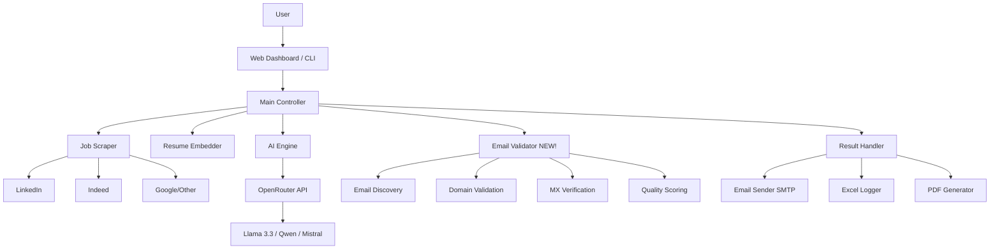

# 🚀 AI Jobs Finder - Automated Job Application System (Enhanced)

An intelligent automated tool that scrapes job websites, generates **personalized application emails** using **OpenRouter AI**, attaches your resume and **AI-generated motivational letters**, and sends them via SMTP with **advanced email validation** to ensure only genuine company emails are contacted.

## ✨ What's New in This Version

### 🎯 Enhanced Email Discovery & Validation
- **Advanced Email Validator**: Multi-stage validation (syntax, domain, MX records, company matching)
- **Smart Scoring System**: Prioritizes company emails over generic providers (Gmail, Yahoo)
- **Platform Email Blocking**: Automatically filters out job platform emails (LinkedIn, Indeed, Freelancer)
- **Domain Matching**: Validates emails match the actual company domain
- **Quality Scoring**: Each email gets a quality score (0-100) based on multiple factors

### 🎨 Modern Premium UI
- **Glassmorphism Design**: Beautiful frosted-glass effects with gradient backgrounds
- **Smooth Animations**: Micro-interactions and transitions for better UX
- **Responsive Layout**: Works perfectly on desktop, tablet, and mobile
- **Interactive Charts**: Doughnut charts for application distribution
- **Real-time Updates**: Auto-refresh stats every 30 seconds
- **Dark Mode Ready**: Built-in support for dark theme

### 📧 Genuine Email Mechanism

The system now has a **3-tier email validation** process:

```
1. DISCOVERY
   ├─ Extract domain from job posting URL
   ├─ Try common domain patterns (company.com, company.io)
   └─ Scrape Google search results

2. COMPREHENSIVE CRAWL
   ├─ Recursively crawl company website (careers, contact, about pages)
   ├─ Extract all emails found
   └─ Score based on page context (careers page = higher score)

3. VALIDATION & SCORING
   ├─ Syntax validation (regex + format checks)
   ├─ Block platform domains (freelancer.com, upwork.com, etc.)
   ├─ Verify MX records (domain can receive emails)
   ├─ Calculate quality score (company match, email prefix, context)
   └─ Return ONLY high-quality validated emails (score >= 50/100)
```

### 📊 Email Quality Scoring Breakdown

| Factor | Max Points | Description |
|--------|-----------|-------------|
| **Syntax Valid** | 20 | Proper email format |
| **Not Blocked** | 20 | Not a job platform/spam domain |
| **MX Records** | 20 | Domain has valid mail server |
| **Company Match** | 40 | Email domain matches company |
| **Prefix Quality** | 15 | Contains keywords like "careers", "hr", "jobs" |
| **Context** | 15 | Found on careers/contact page |

**Total:** 100 points

- **70-100**: Highly Recommended ✅
- **50-69**: Acceptable ⚠️
- **30-49**: Low Quality ⚠️
- **0-29**: Rejected ❌

---

## 🎯 Key Features

- ✅ **Multi-Platform Job Scraping**: Scrapes from Freelancer, RemoteOK, Guru, LinkedIn, and Google Jobs
- ✅ **Clean AI Output**: Generates professional emails without markdown artifacts
- ✅ **OpenRouter Integration**: Access to premium AI models for free (Llama 3.3 70B, Qwen3, Mistral)
- ✅ **AI Motivational Letters**: Generates tailored PDF motivational letters
- ✅ **Smart Email Discovery**: Advanced multi-stage email validation
- ✅ **Company Email Validation**: Ensures emails match actual company domains
- ✅ **Platform Email Blocking**: Filters out job board emails automatically
- ✅ **MX Record Verification**: Validates domain can receive emails
- ✅ **Excel Activity Logging**: Tracks all jobs, emails, and statuses
- ✅ **Modern Web Dashboard**: Beautiful, responsive UI with real-time updates
- ✅ **Dockerized**: Easy deployment with Docker Compose

---

## 🏗️ System Architecture



---

## ⚙️ Configuration (Required)

Before running, configure the project:

### 1. Configure Environment

Copy `.env.example` to `.env` and fill in your details:

```bash
cp .env.example .env
```

**Required `.env` settings:**

```ini
# OpenRouter API Key (Free tier available)
OPENROUTER_API_KEY=sk-or-v1-xxxxxxxx...

# SMTP Configuration (Gmail App Password)
SMTP_EMAIL=your_email@gmail.com
SMTP_PASSWORD=xxxx xxxx xxxx xxxx  # 16-char App Password

# Resume Path (Absolute path)
RESUME_PATH=D:\My projects\freelance_mailer_package\resume.pdf

# AI Model (Free models recommended)
AI_MODEL=meta-llama/llama-3.3-70b-instruct:free

# Job Search Settings
JOB_TYPE=software
JOB_CATEGORY=freelance  # or 'normal'
JOB_LIMIT=30

# Email Sending
SEND_EMAILS=false  # Set to 'true' to actually send

# Motivational Letter
GENERATE_MOTIVATIONAL_LETTER=true

# Email Validation Configuration (NEW!)
CRAWL_DEPTH=2                    # Max depth to crawl websites
CRAWL_MAX_PAGES=15               # Max pages per website
CRAWL_TIMEOUT=5                  # Timeout per page (seconds)
TOTAL_CRAWL_TIME_LIMIT=60        # Max total crawl time (seconds)
```

### 2. Place Resume

Ensure your `resume.pdf` exists at the path specified in `RESUME_PATH`.

---

## 🚀 Installation & Usage

### Option 1: Docker (Recommended)

```bash
# Build and run
docker-compose up -d --build

# Access
# Dashboard: http://localhost:3000
# Backend API: http://localhost:5000

# Stop
docker-compose down
```

### Option 2: Manual Installation

**Backend:**
```bash
cd backend
pip install -r requirements.txt
python server.py  # Starts at http://localhost:5000
```

**Frontend:**
```bash
cd frontend
npm install
npm run dev  # Starts at http://localhost:3000
```

---

## 🤖 Supported Free AI Models (Verified)

| Model ID | Description | Best For |
|----------|-------------|----------|
| `meta-llama/llama-3.3-70b-instruct:free` | **Recommended Default** | Professional, high quality |
| `qwen/qwen3-coder:free` | Excellent for Code | Developer/Technical roles |
| `mistralai/devstral-2512:free` | Agentic Coder | General purpose |
| `nousresearch/hermes-3-llama-3.1-405b:free` | Massive Model | Complex reasoning |

---

## 📧 Email Validation Examples

### Example 1: Perfect Match ✅
```
Company: "TechCorp Solutions"
Job Domain: techcorp.com
Found Email: careers@techcorp.com

✓ Valid syntax
✓ Not blocked
✓ Valid MX: mx1.techcorp.com
✓ Perfect domain match
✓ Priority keyword: "careers"
✓ Found on careers page

Score: 95/100 - HIGHLY RECOMMENDED
```

### Example 2: Generic Provider ⚠️
```
Company: "Startup Inc"
Job Domain: startup.io
Found Email: contact@gmail.com

✓ Valid syntax
✓ Not blocked
✓ Valid MX: gmail-smtp-in.l.google.com
✗ Domain mismatch (generic provider)

Score: 45/100 - LOW QUALITY (Skipped)
```

### Example 3: Platform Email ❌
```
Company: "Client via Freelancer"
Job Domain: freelancer.com
Found Email: jobs@freelancer.com

✓ Valid syntax
✗ BLOCKED DOMAIN (job platform)

Score: 0/100 - REJECTED
```

---

## 🛠️ Troubleshooting

### 1. SMTP Authentication Error (535, 5.7.8)

**Cause:** Using main Gmail password or expired App Password.

**Fix:** Generate a NEW App Password at [Google Account Security](https://myaccount.google.com/apppasswords) and update `.env`.

### 2. No Emails Found for Jobs

**Cause:** Website blocks web scraping or emails are obfuscated.

**Fix:** 
- Lower `CRAWL_DEPTH` to 1 (faster, less thorough)
- Increase `CRAWL_MAX_PAGES` to 25 (more thorough)
- Check if company website has a contact page

### 3. All Emails Rejected

**Cause:** Email quality scores too low.

**Fix:** Check logs to see why emails are failing. Common reasons:
- Job posting is from a recruiter using personal email
- Company domain doesn't match job posting
- Website doesn't list contact emails

### 4. Rate Limits / Quota Exceeded

**Cause:** Using a paid model or hitting free tier limits.

**Fix:** Switch `AI_MODEL` to one of the verified free models listed above.

---

## 📁 Project Structure

```
freelance_mailer_package/
├── backend/
│   ├── modules/
│   │   ├── ai_wrapper.py              # OpenRouter API integration
│   │   ├── email_agent.py             # Email generation & discovery
│   │   ├── email_validator.py         # NEW! Advanced email validation
│   │   ├── scraper.py                 # Job scraping logic
│   │   ├── smtp_sender.py             # Email sending via SMTP
│   │   ├── excel_logger.py            # Activity logging
│   │   └── motivational_letter_generator.py
│   ├── main.py                        # CLI entry point
│   ├── server.py                      # Flask API server
│   └── requirements.txt
├── frontend/
│   ├── src/
│   │   ├── components/
│   │   │   ├── Dashboard.jsx          # Enhanced with modern UI
│   │   │   ├── JobStats.jsx           # Improved with charts
│   │   │   └── ...
│   │   └── styles/                    # Premium CSS with animations
│   └── package.json
├── .env.example
├── docker-compose.yml
└── README.md
```

---

## 🔐 Security & Privacy

- **Email Validation**: Ensures only genuine company emails are contacted
- **No Spam**: Blocks job platform and temporary email domains
- **MX Verification**: Validates domains can actually receive emails
- **Local Processing**: All AI processing happens via OpenRouter API (no data stored)
- **SMTP Security**: Uses Gmail App Passwords (not your main password)

---

## 📊 Usage Tips

1. **Start with Dry Run**: Set `SEND_EMAILS=false` to test email generation
2. **Review Logs**: Check `email_log.xlsx` to see what emails were found
3. **Adjust Crawl Settings**: Balance between thoroughness and speed
4. **Monitor Success Rate**: Aim for 60%+ success rate by refining job search
5. **Use Specific Job Types**: More specific = better email matches

---

## 🎨 UI Screenshots

### Dashboard
- Modern glassmorphism design
- Real-time stats with animated counters
- Quick action cards with hover effects
- Recent activity feed

### Job Runner
- Live progress tracking
- Streaming console output
- Success/failure indicators

### Activity Logs
- Filterable by status, platform, date
- Detailed email validation results
- Export to Excel

---

## 📄 License

MIT License

---

## 🙏 Acknowledgments

- OpenRouter for free AI API access
- Chart.js for beautiful visualizations
- React + Vite for modern frontend
- Flask for lightweight backend

---

**Happy Job Hunting! 🚀**

**Questions?** Check the troubleshooting section or open an issue on GitHub.
