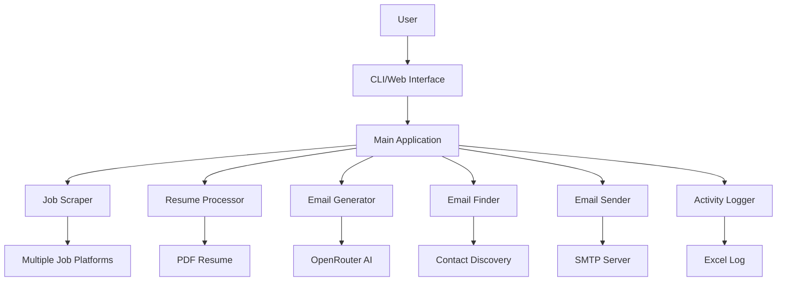
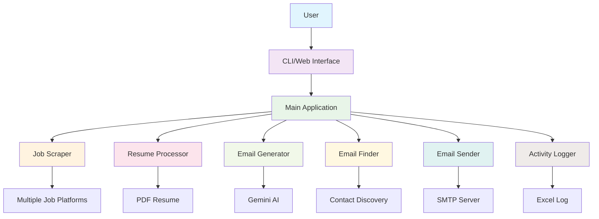

# Freelance Mailer - Automated Job Application System

An intelligent automated tool that scrapes job websites, generates **personalized application emails** using **OpenRouter AI**, attaches resume and **AI-generated motivational letters**, and sends them via SMTP. Features **smart company filtering** to prioritize local companies over FAANG.

## 🎯 Key Features

- ✅ **Multi-Platform Job Scraping**: Scrapes from Freelancer, RemoteOK, Guru, LinkedIn, Indeed, Glassdoor, and Google Jobs
- ✅ **Smart Duplicate Detection**: Automatically skips already-processed jobs using Excel tracking
- ✅ **AI-Powered Email Generation**: Uses OpenRouter AI to create personalized, professional emails
- ✅ **AI Motivational Letters**: Generates tailored motivational letters in PDF format
- ✅ **Intelligent Email Discovery**: Finds company contact emails using AI + Google Search
- ✅ **Local Company Priority**: Smart filtering to prioritize local/regional companies over FAANG
- ✅ **Location-Based Filtering**: Target jobs in specific cities/regions
- ✅ **Automatic Resume Attachment**: Attaches your PDF resume to every email
- ✅ **Excel Activity Logging**: Tracks all jobs, emails, and statuses in `email_log.xlsx`
- ✅ **Web Dashboard**: User-friendly interface for configuration and monitoring
- ✅ **Docker Support**: Easy deployment with Docker and docker-compose
- ✅ **Free AI Models**: 30+ free OpenRouter models available

## 📋 Table of Contents

- [System Architecture](#system-architecture)
- [Prerequisites](#prerequisites)
- [Installation](#installation)
- [Configuration](#configuration)
- [AI Models](#ai-models)
- [Usage](#usage)
- [How It Works](#how-it-works)
- [Company Filtering & Prioritization](#company-filtering--prioritization)
- [Docker Usage](#docker-usage)
- [Troubleshooting](#troubleshooting)
- [Security Notes](#security-notes)

## 🏗️ System Architecture



### Components

1. **Job Scraper**: Collects job listings from multiple platforms with smart filtering
2. **Resume Processor**: Extracts text from PDF resume for AI personalization
3. **Email Generator**: Creates personalized emails using OpenRouter AI
4. **Email Finder**: Discovers company contact emails through AI-powered search
5. **Email Sender**: Sends emails with resume and motivational letter attachments
6. **Activity Logger**: Records all actions in Excel with duplicate detection
7. **Web Dashboard**: Provides a user-friendly interface for job control

## 📦 Prerequisites

- **Python 3.8+**
- **Node.js 16+** (for web dashboard)
- **OpenRouter API Key** (free tier available) - [Get one here](https://openrouter.ai/)
- **SMTP credentials** (Gmail app password recommended)
- **Resume in PDF format**
- **Optional**: Google Custom Search API for enhanced email finding

## 🚀 Installation

### Option 1: Direct Installation

1. **Clone the repository:**

   ```bash
   git clone <repository-url>
   cd freelance_mailer_package
   ```

2. **Create a virtual environment:**

   ```bash
   python -m venv venv
   ```

3. **Activate the virtual environment:**
   - Windows: `venv\Scripts\activate`
   - macOS/Linux: `source venv/bin/activate`

4. **Install backend dependencies:**

   ```bash
   pip install -r backend/requirements.txt
   ```

5. **Install frontend dependencies:**

   ```bash
   cd frontend
   npm install
   cd ..
   ```

### Option 2: Using Make (Recommended)

```bash
# Install all dependencies
make setup

# Or install separately
make setup-backend
make setup-frontend
```

## ⚙️ Configuration

### Environment Setup

1. **Copy the example environment file:**

   ```bash
   cp .env.example .env
   # OR
   make env-example
   ```

2. **Edit `.env` with your configuration:**

```env
# ===========================================
# REQUIRED SETTINGS
# ===========================================

# OpenRouter API Key (Get from https://openrouter.ai/)
OPENROUTER_API_KEY=your_openrouter_api_key_here

# SMTP Configuration (Gmail recommended)
SMTP_SERVER=smtp.gmail.com
SMTP_PORT=587
SMTP_EMAIL=your_email@gmail.com
SMTP_PASSWORD=your_gmail_app_password

# Path to your resume PDF
RESUME_PATH=D:\path\to\your\resume.pdf

# ===========================================
# JOB SEARCH SETTINGS
# ===========================================

# Job Type: software, web, mobile, data, etc.
JOB_TYPE=software

# Job Category: 'freelance' or 'normal' (full-time)
JOB_CATEGORY=freelance

# Number of jobs to process per run
JOB_LIMIT=30

# Location for local job prioritization
LOCATION=Mumbai

# Specific job name (optional)
# JOB_NAME=React Developer

# ===========================================
# AI MODEL SETTINGS
# ===========================================

# Default AI Model (Free)
AI_MODEL=google/gemini-2.0-flash-exp:free

# ===========================================
# COMPANY FILTERING SETTINGS
# ===========================================

# Company Priority: 'local', 'mixed', or 'faang'
COMPANY_PRIORITY=local

# Completely exclude FAANG companies
EXCLUDE_FAANG=false

# ===========================================
# EMAIL SETTINGS
# ===========================================

# Set to 'true' to actually send emails, 'false' for dry run
SEND_EMAILS=false

# Generate motivational letters
GENERATE_MOTIVATIONAL_LETTER=true

# ===========================================
# OPTIONAL: GOOGLE SEARCH API
# ===========================================

# For enhanced email finding (optional)
# GOOGLE_SEARCH_API_KEY=your_api_key
# GOOGLE_SEARCH_ENGINE_ID=your_engine_id

# ===========================================
# RETRY SETTINGS
# ===========================================

MAX_RETRY_ATTEMPTS=3
RETRY_DELAY_HOURS=1
```

### Important Notes

- **Never commit your `.env` file** to version control
- **Use app-specific passwords** for Gmail
- **Run in dry-run mode first** (`SEND_EMAILS=false`)
- **Start with small job limits** (5-10) for testing

## 🤖 AI Models

The system uses **OpenRouter** which provides access to **30+ free AI models**. No API costs!

### Recommended Free Models

| Model | Best For | Pros |
|-------|----------|------|
| `google/gemini-2.0-flash-exp:free` | **General Use** (Default) | Fast, reliable, great quality |
| `meta-llama/llama-3.3-70b-instruct:free` | Formal Applications | Professional tone |
| `qwen/qwen3-coder:free` | Tech Jobs | Code-aware writing |
| `mistralai/mistral-small-3.1-24b-instruct:free` | Creative Writing | Engaging content |

### All Available Free Models

<details>
<summary>Click to view all 30+ free models</summary>

- `nousresearch/hermes-3-llama-3.1-405b:free` - Hermes 3 Llama 3.1 405B
- `google/gemini-2.0-flash-exp:free` - **Gemini 2.0 Flash** (Recommended)
- `meta-llama/llama-3.3-70b-instruct:free` - Llama 3.3 70B
- `qwen/qwen3-coder:free` - Qwen3 Coder
- `mistralai/mistral-small-3.1-24b-instruct:free` - Mistral Small 3.1
- `google/gemma-3-27b-it:free` - Gemma 3 27B
- And 24+ more models!

</details>

### Switching Models

**Method 1: Environment Variable**

```env
AI_MODEL=google/gemini-2.0-flash-exp:free
```

**Method 2: Command Line**

```bash
python backend/main.py --ai-model="meta-llama/llama-3.3-70b-instruct:free"
```

**Method 3: Switch Script**

```bash
# List all models
python switch_model.py

# Switch to model #50 (Gemini Flash)
python switch_model.py 50
```

**Method 4: Web Dashboard**

- Select your model from the dropdown in the Job Runner section

## 💻 Usage

### Command Line Interface

```bash
# Basic usage (Dry run - no emails sent)
python backend/main.py

# Actually send emails
python backend/main.py --send

# Specify parameters
python backend/main.py \
  --job-category=freelance \
  --job-type=software \
  --job-limit=10 \
  --location="Mumbai" \
  --ai-model="google/gemini-2.0-flash-exp:free"

# Search for specific job title in a location
python backend/main.py \
  --job-category=normal \
  --job-name="React Developer" \
  --location="Bangalore" \
  --job-limit=5 \
  --send

# View all options
python backend/main.py --help
```

### Using Make Commands

```bash
# See all available commands
make help

# Run job processing (dry run)
make run-jobs

# Run and actually send emails
make run-jobs-send

# Start backend server
make run-backend

# Start frontend dashboard
make run-frontend

# Build and run with Docker
make build-docker
make run-docker

# Stop Docker containers
make stop-docker
```

### Web Dashboard

1. **Start the backend server:**

   ```bash
   python backend/server.py
   # OR
   make run-backend
   ```

2. **Open in browser:**

   ```
   http://localhost:5000
   ```

3. **Configure and run** jobs through the web interface

## 🔍 How It Works

### Complete Workflow

1. **Job Scraping**
   - Scrapes jobs from multiple platforms based on your criteria
   - Applies location and company type filters
   - Assigns relevance scores to each job

2. **Duplicate Detection**
   - Checks `email_log.xlsx` for already-processed jobs
   - Skips previously contacted companies
   - Only processes new opportunities

3. **Resume Processing**
   - Extracts text from your PDF resume
   - Prepares content for AI personalization

4. **Email Generation**
   - Uses OpenRouter AI to create personalized emails
   - Tailors content to job description and requirements
   - Maintains professional tone

5. **Contact Discovery**
   - AI-powered search using OpenRouter
   - Google Custom Search API (if configured)
   - Common email pattern generation as fallback
   - Email validation and authenticity checks

6. **Motivational Letter Creation**
   - Generates personalized motivational letters
   - Saves as PDF in `motivational_letters/` folder
   - Attaches to application email

7. **Email Sending**
   - Sends emails with resume and letter attached
   - Uses SMTP (recommended: Gmail)
   - Only sends to verified company emails (not platforms)

8. **Activity Logging**
   - Logs all activities to `email_log.xlsx`
   - Tracks: job details, emails sent, timestamps, statuses
   - Enables retry queue for failed attempts

## 🎯 Company Filtering & Prioritization

The application includes **smart filtering** to help you target the right companies.

### How It Works

Jobs are scored based on three factors:

| Factor | Maximum Points | Description |
|--------|---------------|-------------|
| **Location Match** | **40 points** | Exact city match gets full points |
| **Company Type** | **30 points** | Local companies scored highest |
| **Job Title Match** | **30 points** | Exact title match gets full points |

**Total Score:** Up to **100 points**

### Company Classification

| Company Type | Score | Examples |
|--------------|-------|----------|
| **Local/Regional** | 30 pts | Local startups, regional businesses |
| **Startups/Agencies** | 25 pts | Tech startups, digital agencies |
| **Big Tech** | 15 pts | TCS, Infosys, Wipro, Accenture |
| **FAANG** | 10 pts | Google, Amazon, Facebook, Apple, Netflix |

### Configuration

```env
# Prioritize local companies in Mumbai
LOCATION=Mumbai
COMPANY_PRIORITY=local

# Optionally exclude FAANG entirely
EXCLUDE_FAANG=false
```

### Example Scoring

**Job A:** "React Developer at LocalStartup, Mumbai"

- Location: Mumbai (40 pts)
- Company: Local (30 pts)
- Title: Exact match (30 pts)
- **Total: 100 points** ✅

**Job B:** "Software Engineer at Google, Bangalore"

- Location: Different city (5 pts)
- Company: FAANG (10 pts)
- Title: Partial match (20 pts)
- **Total: 35 points** ❌

Result: **Job A appears first** in your results!

## 🐳 Docker Usage

### Quick Start

```bash
# Build and run (development mode)
make run-docker-dev

# Build and run (production mode, detached)
make run-docker

# Stop containers
make stop-docker
```

### Manual Docker Commands

```bash
# Build image
docker build -t jobs-mail-sender .

# Run with docker-compose
docker-compose up --build

# Run with custom environment variables
docker run \
  -e OPENROUTER_API_KEY=your_key \
  -e SMTP_EMAIL=your_email \
  -e SMTP_PASSWORD=your_password \
  -v /path/to/resume.pdf:/app/resume.pdf \
  jobs-mail-sender

# View logs
docker logs jobs-mail-sender

# Access running container
docker exec -it jobs-mail-sender bash
```

### Accessing Services

- **Backend API**: `http://localhost:5000`
- **Frontend Dashboard**: `http://localhost:3001`
- **Redis** (if used): `localhost:6380`

## 🛠️ Troubleshooting

### Common Issues

**1. OpenRouter API 404 Error**

```
ERROR: No endpoints found for model
```

**Solution:** The model might be temporarily unavailable. Switch to a different model:

```env
AI_MODEL=google/gemini-2.0-flash-exp:free
```

**2. SMTP Authentication Failed**

```
ERROR: 535 Authentication failed
```

**Solution:** Use Gmail App Password (not your regular password):

1. Go to Google Account Settings
2. Enable 2-Factor Authentication
3. Generate an App Password
4. Use that password in `.env`

**3. No Jobs Found**

```
No jobs found. Exiting...
```

**Solution:** Try adjusting your search parameters:

- Remove or change `LOCATION`
- Try different `JOB_TYPE`
- Switch between `freelance` and `normal` in `JOB_CATEGORY`

**4. All Jobs Already Processed**

```
Found 0 new jobs to process (skipping 10 already processed jobs)
```

**Solution:** The system is working! It's skipping duplicates. To reset:

- Delete or rename `backend/email_log.xlsx`
- The system will create a fresh log

**5. Model Not Generating Text**
**Solution:** Some free models have rate limits. Wait a few minutes or switch models:

```bash
python switch_model.py
```

### Debugging Tips

1. **Check logs in real-time:**

   ```bash
   # Watch the log file
   tail -f backend/email_log.xlsx
   ```

2. **Test OpenRouter connection:**

   ```bash
   curl -H "Authorization: Bearer YOUR_KEY" \
        https://openrouter.ai/api/v1/models
   ```

3. **Verify email configuration:**

   ```bash
   python -c "from modules.smtp_sender import test_connection; test_connection()"
   ```

4. **Run in dry-run mode first:**

   ```env
   SEND_EMAILS=false
   ```

## 🔒 Security Notes

- ✅ **Never commit your `.env` file** to version control
- ✅ **Use app-specific passwords** for Gmail (not your main password)
- ✅ **Only sends emails to verified company contacts**, not to job platforms
- ✅ **All sensitive data is stored locally** (not transmitted to external servers)
- ✅ **API keys are never logged** or displayed in output
- ✅ **Resume and letters are only attached to verified recipients**

## 📊 Activity Tracking

All activities are logged in `backend/email_log.xlsx`:

| Column | Description |
|--------|-------------|
| Timestamp | When the job was processed |
| Job Title | Position applied for |
| Company | Company name |
| Email | Contact email used |
| Status | `success`, `failed`, `dry_run`, `skipped` |
| Platform | Where the job was found |
| Description | Job description (truncated) |

## 🤝 Contributing

Contributions are welcome! Please:

1. Fork the repository
2. Create a feature branch
3. Make your changes
4. Submit a pull request

## 📄 License

This project is licensed under the MIT License.

## 🙏 Acknowledgments

- **OpenRouter** for providing free AI model access
- **All contributors and users** of this project

## 📞 Support

If you encounter issues:

1. Check this README thoroughly
2. Review the [Troubleshooting](#troubleshooting) section
3. Check `backend/email_log.xlsx` for detailed logs
4. Open an issue on GitHub with:
   - Your error message
   - Steps to reproduce
   - Your configuration (hide sensitive data)

---

**Made with ❤️ for job seekers everywhere**

## System Architecture



### Components

1. **Job Scraper**: Collects job listings from multiple platforms (Various job boards)
2. **Resume Processor**: Extracts text from PDF resume for personalization
3. **Email Generator**: Creates personalized emails using OpenRouter AI
4. **Email Finder**: Discovers company contact emails through multiple strategies
5. **Email Sender**: Sends emails with resume and motivational letter attachments
6. **Activity Logger**: Records all actions in an Excel spreadsheet
7. **Web Dashboard**: Provides a user-friendly interface for configuration and monitoring

## Features

- Scrapes multiple job platforms (Various job types)
- Generates personalized emails and motivational letters using OpenRouter AI
- Automatically finds company contact emails
- Attaches resume and motivational letter to applications
- Logs all activities to Excel spreadsheet
- Web dashboard for easy job control
- Docker support for easy deployment
- Makefile for simplified command execution

## Prerequisites

- Python 3.8 or higher
- Node.js 16+ (for web dashboard)
- OpenRouter API Key (free tier available)
- SMTP credentials (Gmail app password recommended)
- Resume in PDF format

## Installation

### Option 1: Direct Installation

1. Clone the repository:

   ```bash
   git clone <repository-url>
   cd jobs_mail_sender
   ```

2. Create a virtual environment:

   ```bash
   python -m venv venv
   ```

3. Activate the virtual environment:
   - Windows: `venv\Scripts\activate`
   - macOS/Linux: `source venv/bin/activate`

4. Install backend dependencies:

   ```bash
   pip install -r backend/requirements.txt
   ```

5. Install frontend dependencies:

   ```bash
   cd frontend
   npm install
   cd ../..
   ```

### Option 2: Using Make (Recommended)

1. Clone the repository:

   ```bash
   git clone <repository-url>
   cd jobs_mail_sender
   ```

2. Install all dependencies:

   ```bash
   make setup
   ```

## Environment Configuration

### Understanding Environment Files

There are two environment files in the project:

1. **`.env`** (Root directory): The main configuration file that the application uses
2. **`.env.example`** (Root directory): Template file with all configuration options

**Note**: The `backend/.env` file is legacy and will be removed. The application now uses the root `.env` file.

### Setting Up Your Environment

1. Copy the `.env.example` to `.env`:

   ```bash
   cp .env.example .env
   ```

   Or using Make:

   ```bash
   make env-example
   ```

2. Edit the `.env` file with your configuration:

   ```env
   # OpenRouter API Key (required)
   OPENROUTER_API_KEY=your_openrouter_api_key
   
   # SMTP configuration
   SMTP_SERVER=smtp.gmail.com
   SMTP_PORT=587
   SMTP_EMAIL=your_email@gmail.com
   SMTP_PASSWORD=your_app_password
   
   # Path to your resume PDF
   RESUME_PATH=path/to/your/resume.pdf
   
   # Job search settings
   JOB_TYPE=software
   JOB_CATEGORY=normal  # or 'freelance'
   JOB_LIMIT=30
   
   # Email sending mode
   SEND_EMAILS=false  # Set to 'true' to actually send emails
   
   # Motivational letter generation
   GENERATE_MOTIVATIONAL_LETTER=true
   
   # AI Model
   AI_MODEL=nousresearch/hermes-3-llama-3.1-405b:free
   
   # Location and Job Name (optional)
   LOCATION=Mumbai  # Set your preferred location for local job prioritization
   # JOB_NAME=React Developer
   
   # Company Priority Settings (optional)
   COMPANY_PRIORITY=local  # Options: local, mixed, faang
   EXCLUDE_FAANG=false  # Set to 'true' to completely exclude FAANG companies
   
   # Google Search API (optional, for enhanced email finding)
   # GOOGLE_SEARCH_API_KEY=your_google_search_api_key
   # GOOGLE_SEARCH_ENGINE_ID=your_google_search_engine_id
   ```

### Important Notes

- **Never commit your `.env` file** to version control as it contains sensitive information
- **Use app-specific passwords** for Gmail rather than your regular password
- **The application only sends emails to verified company contacts**, not to job platforms
- **The root `.env` file is used by both CLI and web interface**
- **Delete the `backend/.env` file** if it exists to avoid confusion

## AI Models

The application supports multiple AI models through OpenRouter. You can select the model through the web interface or by setting the `AI_MODEL` environment variable.

### Free Models (No Cost)

These models are completely free to use:

- `nousresearch/hermes-3-llama-3.1-405b:free` - Hermes 3 Llama 3.1 405B (Free) *(Default)*
- `mistralai/devstral-2512:free` - DevStral 2512 (Free)
- `nex-agi/deepseek-v3.1-nex-n1:free` - DeepSeek V3.1 NEX N1 (Free)
- `amazon/nova-2-lite-v1:free` - Amazon Nova 2 Lite V1 (Free)
- `arcee-ai/trinity-mini:free` - Arcee Trinity Mini (Free)
- `tngtech/tng-r1t-chimera:free` - TNG R1T Chimera (Free)
- `allenai/olmo-3-32b-think:free` - OLMo 3 32B Think (Free)
- `kwaipilot/kat-coder-pro:free` - KAT Coder Pro (Free)
- `nvidia/nemotron-nano-12b-v2-vl:free` - Nemotron Nano 12B V2 VL (Free)
- `alibaba/tongyi-deepresearch-30b-a3b:free` - Tongyi DeepResearch 30B A3B (Free)
- `nvidia/nemotron-nano-9b-v2:free` - Nemotron Nano 9B V2 (Free)
- `openai/gpt-oss-120b:free` - OpenAI GPT OSS 120B (Free)
- `openai/gpt-oss-20b:free` - OpenAI GPT OSS 20B (Free)
- `z-ai/glm-4.5-air:free` - GLM 4.5 Air (Free)
- `qwen/qwen3-coder:free` - Qwen3 Coder (Free)
- `moonshotai/kimi-k2:free` - Kimi K2 (Free)
- `cognitivecomputations/dolphin-mistral-24b-venice-edition:free` - Dolphin Mistral 24B Venice Edition (Free)
- `google/gemma-3n-e2b-it:free` - Gemma 3N E2B IT (Free)
- `tngtech/deepseek-r1t2-chimera:free` - DeepSeek R1T2 Chimera (Free)
- `google/gemma-3n-e4b-it:free` - Gemma 3N E4B IT (Free)
- `qwen/qwen3-4b:free` - Qwen3 4B (Free)
- `qwen/qwen3-235b-a22b:free` - Qwen3 235B A22B (Free)
- `tngtech/deepseek-r1t-chimera:free` - DeepSeek R1T Chimera (Free)
- `mistralai/mistral-small-3.1-24b-instruct:free` - Mistral Small 3.1 24B Instruct (Free)
- `google/gemma-3-4b-it:free` - Gemma 3 4B IT (Free)
- `google/gemma-3-12b-it:free` - Gemma 3 12B IT (Free)
- `google/gemma-3-27b-it:free` - Gemma 3 27B IT (Free)
- `google/gemini-2.0-flash-exp:free` - Gemini 2.0 Flash EXP (Free)
- `meta-llama/llama-3.3-70b-instruct:free` - Llama 3.3 70B Instruct (Free)
- `meta-llama/llama-3.2-3b-instruct:free` - Llama 3.2 3B Instruct (Free)
- `mistralai/mistral-7b-instruct:free` - Mistral 7B Instruct (Free)

### Paid Models (Requires OpenRouter Credits)

These models require OpenRouter credits to use:

- `google/gemini-flash-1.5-8b` - Gemini Flash 1.5 8B
- `meta-llama/llama-3.1-70b-instruct` - Llama 3.1 70B Instruct
- `openai/gpt-4o-mini` - GPT-4o Mini

### Switching Models

You can easily switch between different free models using either the web interface or the command-line utility:

1. **Web Interface**: Select your desired model from the dropdown in the Job Runner section
2. **Command Line**: Use the included `switch_model.py` script:

   ```bash
   # List all available models
   python switch_model.py
   
   # Switch to a specific model (e.g., model #3)
   python switch_model.py 3
   ```

## Usage

### Command Line Interface

```bash
# Dry run (default) - generates emails but doesn't send them
python backend/main.py

# Actually send emails
python backend/main.py --send

# Specify job type and category
python backend/main.py --job-type=data --job-category=freelance --job-limit=10

# Generate motivational letters (enabled by default)
python backend/main.py --generate-motivational-letter

# Use a specific AI model
python backend/main.py --ai-model=meta-llama/llama-3.1-70b-instruct

# Search for jobs in a specific location
python backend/main.py --location="New York"

# Search for a specific job name
python backend/main.py --job-name="React Developer"

# View all options
python backend/main.py --help
```

### Using Make (Recommended)

```bash
# See all available commands
make help

# Install all dependencies
make setup

# Start the backend server
make run-backend

# Start the frontend development server
make run-frontend

# Run job processing (dry run)
make run-jobs

# Run job processing and send emails
make run-jobs-send

# Build and run with Docker
make build-docker
make run-docker

# Run tests
make test

# Clean temporary files
make clean
```

### Web Dashboard

Start the web server:

```bash
python backend/server.py
```

Then open `http://localhost:5000` in your browser.

### Docker Usage

```bash
# Build and run with docker-compose
docker-compose up --build

# Run with custom environment variables
docker run -e OPENROUTER_API_KEY=your_key -e SMTP_EMAIL=your_email -e SMTP_PASSWORD=your_password -v /path/to/resume.pdf:/app/resume.pdf jobs-mail-sender

# Run a specific command
docker run jobs-mail-sender python backend/main.py --help
```

## How It Works

1. **Job Scraping**: Scrapes job listings from multiple platforms based on your criteria
2. **Resume Processing**: Processes your resume to extract relevant information
3. **Email Generation**: Generates personalized email content using OpenRouter AI
4. **Contact Discovery**: Attempts to find the appropriate contact email for each company using multiple strategies:
   - Direct extraction from job postings
   - AI-powered search using OpenRouter
   - Google Custom Search API (if configured)
   - Common email pattern generation
5. **Motivational Letter Creation**: Generates personalized motivational letters for each position
6. **Email Sending**: Sends emails with your resume and motivational letter attached
7. **Activity Logging**: Logs all activities to `email_log.xlsx`

## Company Filtering & Prioritization

The application now includes smart filtering to help you target the right companies:

- **Local Priority**: Prioritizes companies in your specified `LOCATION` (e.g., Mumbai, Bangalore).
- **Company Classification**: distinguishing between:
  - **Local/Regional**: Higher priority (30 points)
  - **Startups**: High priority (25 points)
  - **Big Tech**: Lower priority (15 points)
  - **FAANG**: Low priority (10 points)
- **Scoring System**: Jobs are sorted by a relevance score based on:
  - Location match (+40 points for exact match)
  - Company type (Local > Startup > Big Tech > FAANG)
  - Job title match (+30 points for exact match)

You can configure this in your `.env` file:

```env
LOCATION=Mumbai
COMPANY_PRIORITY=local
EXCLUDE_FAANG=false
```

## Security Notes

- Never commit your `.env` file to version control
- Use app-specific passwords for Gmail rather than your regular password
- The application only sends emails to verified company contacts, not to job platforms
- All sensitive data is stored locally and not transmitted to external servers

## Troubleshooting

- Ensure your OpenRouter API key is valid and has the necessary permissions
- Check that your SMTP credentials are correct
- Verify your resume path is correct and accessible
- If emails aren't sending, try running in dry-run mode first to test the process
- Make sure your `.env` file is in the root directory, not in the backend directory

## Contributing

Contributions are welcome! Please fork the repository and submit a pull request.
