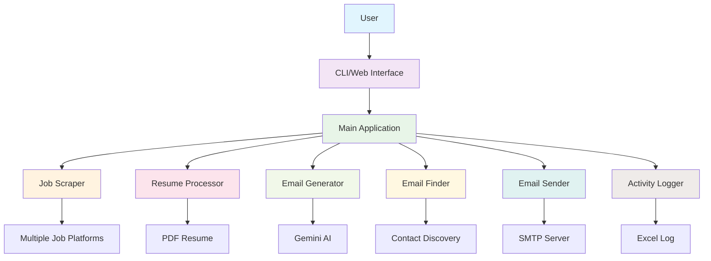

# Jobs Mail Sender

An automated tool that scrapes job websites, generates personalized application emails using Gemini AI, attaches resume and motivational letters, and sends via SMTP.

## System Architecture



### Components

1. **Job Scraper**: Collects job listings from multiple platforms (Various job boards)
2. **Resume Processor**: Extracts text from PDF resume for personalization
3. **Email Generator**: Creates personalized emails using Gemini AI
4. **Email Finder**: Discovers company contact emails through multiple strategies
5. **Email Sender**: Sends emails with resume and motivational letter attachments
6. **Activity Logger**: Records all actions in an Excel spreadsheet
7. **Web Dashboard**: Provides a user-friendly interface for configuration and monitoring

## Features
- Scrapes multiple job platforms (Various job types)
- Generates personalized emails and motivational letters using Gemini AI
- Automatically finds company contact emails
- Attaches resume and motivational letter to applications
- Logs all activities to Excel spreadsheet
- Web dashboard for easy job control
- Docker support for easy deployment
- Makefile for simplified command execution

## Prerequisites
- Python 3.8 or higher
- Node.js 16+ (for web dashboard)
- Gemini API Key
- SMTP credentials (Gmail app password recommended)
- Resume in PDF format

## Installation

### Option 1: Direct Installation
1. Clone the repository:
   ```bash
   git clone <repository-url>
   cd jobs_mail_sender
   ```

2. Create a virtual environment:
   ```bash
   python -m venv venv
   ```

3. Activate the virtual environment:
   - Windows: `venv\Scripts\activate`
   - macOS/Linux: `source venv/bin/activate`

4. Install backend dependencies:
   ```bash
   pip install -r backend/requirements.txt
   ```

5. Install frontend dependencies:
   ```bash
   cd frontend
   npm install
   cd ../..
   ```

### Option 2: Using Make (Recommended)
1. Clone the repository:
   ```bash
   git clone <repository-url>
   cd jobs_mail_sender
   ```

2. Install all dependencies:
   ```bash
   make setup
   ```

## Environment Configuration

### Understanding Environment Files

There are two environment files in the project:
1. **`.env`** (Root directory): The main configuration file that the application uses
2. **`.env.example`** (Root directory): Template file with all configuration options

**Note**: The `backend/.env` file is legacy and will be removed. The application now uses the root `.env` file.

### Setting Up Your Environment

1. Copy the `.env.example` to `.env`:
   ```bash
   cp .env.example .env
   ```
   Or using Make:
   ```bash
   make env-example
   ```

2. Edit the `.env` file with your configuration:
   ```env
   # Gemini API Key (required)
   GEMINI_API_KEY=your_actual_gemini_api_key
   
   # SMTP configuration
   SMTP_SERVER=smtp.gmail.com
   SMTP_PORT=587
   SMTP_EMAIL=your_email@gmail.com
   SMTP_PASSWORD=your_app_password
   
   # Path to your resume PDF
   RESUME_PATH=path/to/your/resume.pdf
   
   # Job search settings
   JOB_TYPE=software
   JOB_CATEGORY=normal  # or 'freelance'
   JOB_LIMIT=30
   
   # Email sending mode
   SEND_EMAILS=false  # Set to 'true' to actually send emails
   
   # Motivational letter generation
   GENERATE_MOTIVATIONAL_LETTER=true
   
   # Google Search API (optional, for enhanced email finding)
   # GOOGLE_SEARCH_API_KEY=your_google_search_api_key
   # GOOGLE_SEARCH_ENGINE_ID=your_google_search_engine_id
   ```

### Important Notes

- **Never commit your `.env` file** to version control as it contains sensitive information
- **Use app-specific passwords** for Gmail rather than your regular password
- **The application only sends emails to verified company contacts**, not to job platforms
- **The root `.env` file is used by both CLI and web interface**
- **Delete the `backend/.env` file** if it exists to avoid confusion

## Usage

### Command Line Interface
```bash
# Dry run (default) - generates emails but doesn't send them
python backend/main.py

# Actually send emails
python backend/main.py --send

# Specify job type and category
python backend/main.py --job-type=data --job-category=freelance --job-limit=10

# Generate motivational letters (enabled by default)
python backend/main.py --generate-motivational-letter

# View all options
python backend/main.py --help
```

### Using Make (Recommended)
```bash
# See all available commands
make help

# Install all dependencies
make setup

# Start the backend server
make run-backend

# Start the frontend development server
make run-frontend

# Run job processing (dry run)
make run-jobs

# Run job processing and send emails
make run-jobs-send

# Build and run with Docker
make build-docker
make run-docker

# Run tests
make test

# Clean temporary files
make clean
```

### Web Dashboard
Start the web server:
```bash
python backend/server.py
```
Then open `http://localhost:5000` in your browser.

### Docker Usage
```bash
# Build and run with docker-compose
docker-compose up --build

# Run with custom environment variables
docker run -e GEMINI_API_KEY=your_key -e SMTP_EMAIL=your_email -e SMTP_PASSWORD=your_password -v /path/to/resume.pdf:/app/resume.pdf jobs-mail-sender

# Run a specific command
docker run jobs-mail-sender python backend/main.py --help
```

## How It Works

1. **Job Scraping**: Scrapes job listings from multiple platforms based on your criteria
2. **Resume Processing**: Processes your resume to extract relevant information
3. **Email Generation**: Generates personalized email content using Gemini AI
4. **Contact Discovery**: Attempts to find the appropriate contact email for each company using multiple strategies:
   - Direct extraction from job postings
   - AI-powered search using Gemini
   - Google Custom Search API (if configured)
   - Common email pattern generation
5. **Motivational Letter Creation**: Generates personalized motivational letters for each position
6. **Email Sending**: Sends emails with your resume and motivational letter attached
7. **Activity Logging**: Logs all activities to `email_log.xlsx`

## Security Notes
- Never commit your `.env` file to version control
- Use app-specific passwords for Gmail rather than your regular password
- The application only sends emails to verified company contacts, not to job platforms
- All sensitive data is stored locally and not transmitted to external servers

## Troubleshooting
- Ensure your Gemini API key is valid and has the necessary permissions
- Check that your SMTP credentials are correct
- Verify your resume path is correct and accessible
- If emails aren't sending, try running in dry-run mode first to test the process
- Make sure your `.env` file is in the root directory, not in the backend directory

## Contributing
Contributions are welcome! Please fork the repository and submit a pull request.