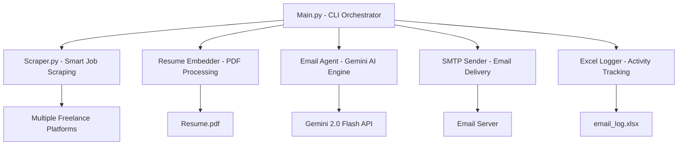

# Freelance Mailer

Automated tool that scrapes software/tech freelancing websites, generates personalized application emails using Gemini AI, attaches your resume, and sends applications via SMTP. All email activities are tracked in an Excel log for review.

## Table of Contents
- [System Architecture](#system-architecture)
- [Enhanced Features](#enhanced-features)
- [Prerequisites](#prerequisites)
- [Installation](#installation)
- [Configuration](#configuration)
- [Usage](#usage)
- [Excel Logging](#excel-logging)
- [Project Structure](#project-structure)
- [Supportive Resources](#supportive-resources)
- [Notes](#notes)

## System Architecture



**Workflow Process:**
1. **Job Discovery**: Smart scraper finds 20 software/tech jobs from multiple platforms
2. **Email Intelligence**: AI analyzes jobs and finds valid company contact emails
3. **Personalization**: Gemini creates tailored cover letters starting with "Hi Sir,"
4. **Validation**: System validates emails and skips invalid/platform addresses
5. **Delivery**: Sends personalized applications with resume attachments
6. **Tracking**: All activities logged to Excel for performance analysis

## Enhanced Features

- 🔍 **Intelligent Multi-site Scraping**: Scrapes 4+ platforms for software/tech jobs only
- 🤖 **Gemini 2.0 Flash Powered**: Uses latest AI for superior email generation
- 🎯 **Smart Email Discovery**: Advanced email finding with 3-tier strategy
- 🚫 **Platform Email Blocking**: Never sends to freelancer.com, upwork.com, etc.
- ✅ **Email Validation**: Only targets real company/client email addresses
- 📧 **Professional Formatting**: All emails start with "Hi Sir," as requested
- 📎 **Resume Attachment**: Automatically attaches your resume to all applications
- 🚀 **Secure SMTP Integration**: Gmail-compatible with app password support
- 📊 **Comprehensive Activity Tracking**: Detailed Excel logs with status tracking
- ⚙️ **Safe Dry Run Mode**: Test functionality without sending actual emails
- 📈 **Daily Job Processing**: Handles up to 20 jobs per day automatically

## Features

- 🔍 **Multi-site Scraping**: Automatically scrapes popular freelancing websites for job opportunities
- 🤖 **AI-Powered Personalization**: Generates customized cover letters using Google's Gemini AI
- 📧 **Smart Email Discovery**: Automatically finds company contact emails when not available
- 📎 **Resume Attachment**: Automatically attaches your resume to all applications
- 🚀 **SMTP Integration**: Sends emails via standard SMTP (Gmail compatible with app passwords)
- 📊 **Activity Tracking**: Logs all email activities (sent, failed, dry-run) to Excel for review
- ⚙️ **Dry Run Mode**: Test functionality without actually sending emails

## Prerequisites

- Python 3.8 or higher
- Google Gemini API key (free tier available)
- SMTP-enabled email account (Gmail with app password recommended)
- Resume in PDF format
- Stable internet connection

## Installation

1. Clone or download the repository:
   ```bash
   git clone <repository-url>
   cd freelance_mailer_package
   ```

2. Create a virtual environment (recommended):
   ```bash
   python -m venv venv
   # On Windows:
   venv\Scripts\activate
   # On macOS/Linux:
   source venv/bin/activate
   ```

3. Install dependencies:
   ```bash
   pip install -r requirements.txt
   ```

4. Verify installation:
   ```bash
   python -c "import google.generativeai; print('Gemini API ready')"
   ```

## Configuration

### Environment Variables

Create a `.env` file in the project root with your configuration:

```env
# Required Settings
GEMINI_API_KEY=your_gemini_api_key_here
RESUME_PATH=path/to/your/resume.pdf
SMTP_EMAIL=your_email@gmail.com
SMTP_PASSWORD=your_app_password_here
SMTP_SERVER=smtp.gmail.com
SMTP_PORT=587

# Optional Settings
SEND_EMAILS=false
GOOGLE_SEARCH_API_KEY=your_google_search_api_key  # For enhanced email finding
GOOGLE_SEARCH_ENGINE_ID=your_custom_search_engine_id
```

### Getting Your Gemini API Key

1. Visit [Google AI Studio](https://aistudio.google.com/)
2. Sign in with your Google account
3. Click "Get API key" in the left sidebar
4. Create a new API key
5. Copy and paste it into your `.env` file

### Setting Up Gmail SMTP (Recommended)

1. Enable 2-factor authentication on your Google account
2. Go to [Google Account Security](https://myaccount.google.com/security)
3. Under "Signing in to Google," select "App passwords"
4. Generate a new app password for "Mail"
5. Use this as your `SMTP_PASSWORD` in the `.env` file

### Scraper Customization

Edit [scraper.py](file:///d:/My%20projects/freelance_mailer_package/scraper.py) to customize:
- Target freelancing websites
- Tech keywords for filtering
- Scraping limits and delays
- User agent rotation

## Usage

### Dry Run Mode (Recommended First)
Preview the system without sending actual emails:
```bash
python main.py
```

### Send Actual Applications
Add the `--send` flag to actually send emails:
```bash
python main.py --send
```

### Command Line Arguments

| Argument | Required | Description |
|---------|----------|-------------|
| `--resume` | Yes (via .env) | Path to your resume PDF file |
| `--smtp-email` | Yes (via .env) | Your SMTP email address |
| `--smtp-password` | Yes (via .env) | Your SMTP app password |
| `--send` | No | Flag to actually send emails (omit for dry run) |

### Daily Operation

The system automatically processes up to 20 software/tech jobs per day with intelligent email validation and targeting.
## Excel Logging

All email activities are automatically logged to `email_log.xlsx` in the project directory with comprehensive tracking:

- **Timestamp**: When the action occurred
- **Job Title**: Position being applied to
- **Company Name**: Client or employer
- **Recipient Email**: Target contact address
- **Email Subject**: Generated subject line
- **Email Body**: Full content of the application
- **Status**: DRY_RUN/SUCCESS/FAILED/SKIPPED
- **Error Message**: Details for failed attempts
- **Source URL**: Original job posting link

### Log Analysis Benefits

- Track application success rates
- Review email content for optimization
- Identify skipped jobs and reasons
- Monitor daily processing volume
- Analyze platform performance

## Project Structure

- [`main.py`](file:///d:/My%20projects/freelance_mailer_package/main.py) - Main CLI orchestrator controlling workflow
- [`scraper.py`](file:///d:/My%20projects/freelance_mailer_package/scraper.py) - Enhanced scraper for software/tech jobs with email extraction
- [`resume_embedder.py`](file:///d:/My%20projects/freelance_mailer_package/resume_embedder.py) - PDF text extraction for personalization
- [`email_agent.py`](file:///d:/My%20projects/freelance_mailer_package/email_agent.py) - Gemini AI engine for email generation and discovery
- [`smtp_sender.py`](file:///d:/My%20projects/freelance_mailer_package/smtp_sender.py) - Secure SMTP email delivery system
- [`excel_logger.py`](file:///d:/My%20projects/freelance_mailer_package/excel_logger.py) - Comprehensive activity tracking
- [`requirements.txt`](file:///d:/My%20projects/freelance_mailer_package/requirements.txt) - Python package dependencies

## Supportive Resources

### API Services

- [Google AI Studio - Gemini API](https://aistudio.google.com/) - Free API key registration
- [Google Cloud Console](https://console.cloud.google.com/) - Optional Google Search API setup

### Documentation

- [Gemini API Documentation](https://ai.google.dev/docs) - Official Gemini integration guides
- [Python Email Libraries](https://docs.python.org/3/library/email.html) - SMTP implementation details
- [BeautifulSoup Documentation](https://www.crummy.com/software/BeautifulSoup/bs4/doc/) - Web scraping reference

### Development Tools

- [Visual Studio Code](https://code.visualstudio.com/) - Recommended IDE
- [Python Virtual Environments](https://docs.python.org/3/tutorial/venv.html) - Isolation best practices
- [dotenv Documentation](https://pypi.org/project/python-dotenv/) - Environment variable management

### Troubleshooting

- **403 Errors**: System includes anti-blocking headers and delays
- **Email Not Found**: Multi-tier search with Gemini AI and fallback patterns
- **SMTP Issues**: Verify app password and 2FA settings
- **Scraping Failures**: Check CSS selectors in scraper.py

## Notes

- Always keep your `.env` file secure and never commit it to version control
- The system processes 20 software/tech jobs daily with intelligent filtering
- Only valid company/client emails are targeted (platform emails blocked)
- All emails start with "Hi Sir," for consistent professional greeting
- Dry run mode recommended for initial testing and configuration
- Check [email_log.xlsx](file:///d:/My%20projects/freelance_mailer_package/email_log.xlsx) regularly for performance insights
- For best results, ensure your resume highlights relevant technical skills
- System includes intelligent retry mechanisms for temporary failures